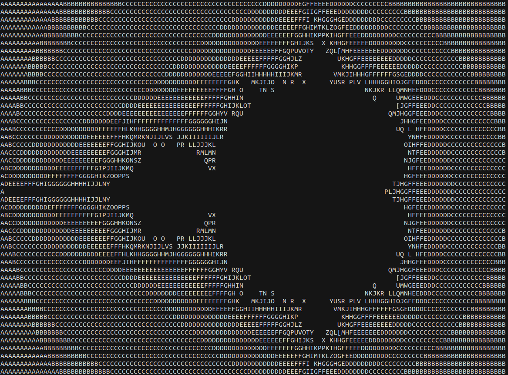

# brainfuckz
A Brainfuck interpreter written in [Zig](https://ziglang.org/).

```bash
$ brainfuckz help
Usage: brain [command]

 Commands:

 code [BRAIN]     Give brainfuck code to execute
 file [PATH]      Execute the code found in a .brain file
 help             Print this help message and exit
 test             Enters interactive mode
```

## Example

### **code**

Run a simple Brainfuck program that prints the letter 'H':
```bash
$ brainfuckz code '>+++++++++[<++++++++>-]<.'
H
```

Print the classic "Hello world!":
```bash
$ brainfuckz code '>+++++++++[<++++++++>-]<.>+++++++[<++++>-]<+.+++++++..+++.[-]
>++++++++[<++++>-] <.>+++++++++++[<++++++++>-]<-.--------.+++
.------.--------.[-]>++++++++[<++++>- ]<+.[-]++++++++++.'
Hello world!
```

### **file**

Run one of the many Brainfuck programs stored in the `program/` subfolder:

```bash
$ brainfuckz file program/MorseTranslate.brain
Brainfuck
-... ..--.- ..--.- ..--.- ..--.- ..--.- ..--.- ..--.- ..--.- -...-
```

A [Mandelbrot](http://esoteric.sange.fi/brainfuck/utils/mandelbrot/) program:
```bash
$ brainfuckz file program/Mandelbrot.brain
```


### **test**

Enter a simple Brainfuck REPL and test simple code:

```bash
$ brainfuckz test
brainfuckz> >+++++++++[<++++++++>-]<.
H
brainfuckz>
```

## Build

```bash
# Pull down this project
$ git clone https://github.com/daneelsan/brainfuckz.git
$ cd brainfuckz

# Build the wasm -- release-safe increases performance by >10x compared to the default debug mode
$ zig build -Drelease-safe

# Start the server
#$ yarn install
#$ yarn dev
```

## Resources

* [Basics of BrainFuck]("https://gist.github.com/roachhd/dce54bec8ba55fb17d3a.js")
* https://thorstenball.com/blog/2017/01/04/a-virtual-brainfuck-machine-in-go/
* http://www.bf.doleczek.pl/
* https://en.wikipedia.org/wiki/Brainfuck
* https://github.com/daneelsan/BrainVirtualMachine
